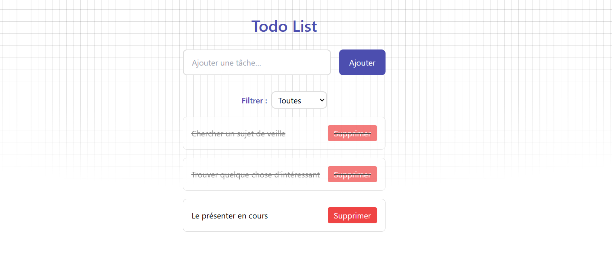
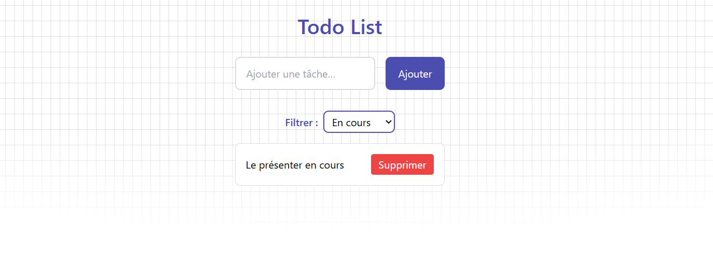

# :pencil2: Projet ToDoList_Ts_Angular

Réécriture de l’application **ToDoList_JS** (JavaScript natif) en **Angular**, **TypeScript** et **Tailwind CSS**, tout en conservant les fonctionnalités (CRUD, filtrage, persistance).

Projet développé par [Christopher PEREZ](https://github.com/Chr1stopherPerez), durant ma formation à [SIMPLON](https://www.simplon.co/).

## Fonctionnalités

- **Ajouter** une nouvelle tâche via le formulaire
- **Supprimer** une tâche individuellement
- **Marquer** une tâche comme terminée ou non
- **Filtrer** l’affichage des tâches (Toutes / En cours / Terminées)
- **Conserver** les tâches en `localStorage` entre deux sessions

## Technologies Utilisées

- **Angular** (CLI)
- **TypeScript**
- **Tailwind CSS**
- **LocalStorage API**

## Structure du Projet

```text
Projet_Todo_Ts_Angular/
├─ docs/
│   └─
├─ src/
│   ├─ app/
│   │   ├─ components/…
│   │   ├─ models/…
│   │   └─ services/…
│   ├─ styles.css
│   └─ main.ts
├─ tailwind.config.js
├─ angular.json
├─ package.json
└─ README.md

```

## Lancer le Projet

1. **Cloner le projet**
   Téléchargez le projet ou clonez le dépôt à partir de GitHub
2. **Ouvrir le projet**

```
cd Projet_Todo_Ts_Angular
```

3. **Installer les dépendances**

```
npm install
```

4. **Lancer le serveur en développement**

```
ng serve --open
```

5. **Tester les fonctionnalités**
   - Ajoutez une tâche via le formulaire
   - Marquez-la comme terminée ou supprimez-la
   - Expérimentez le filtrage des tâches via le sélecteur dédié

## Captures d'Écran



